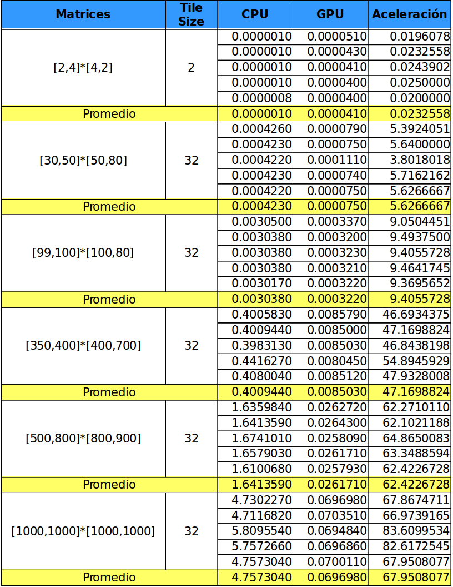
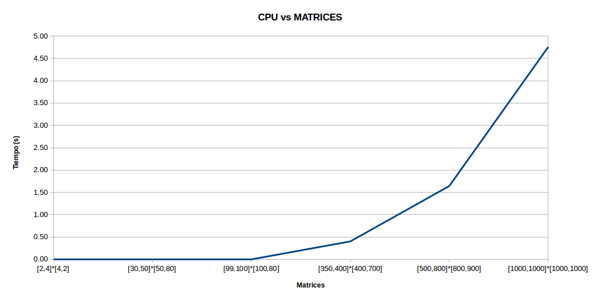
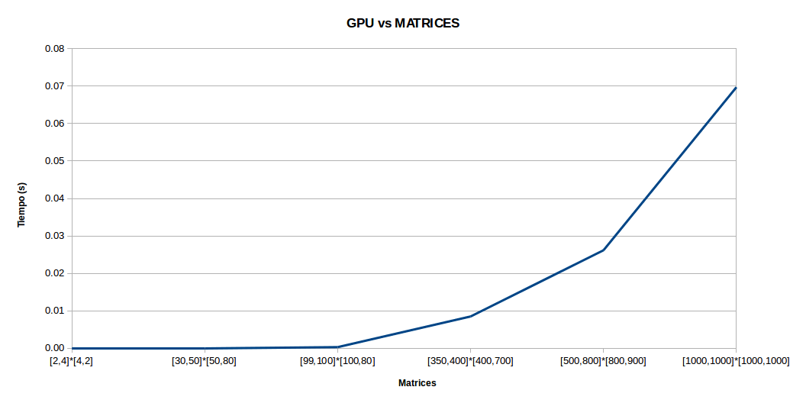
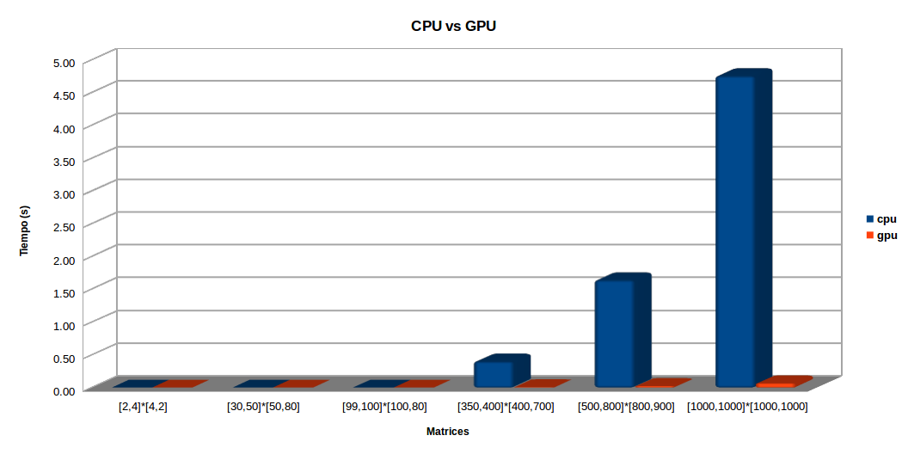
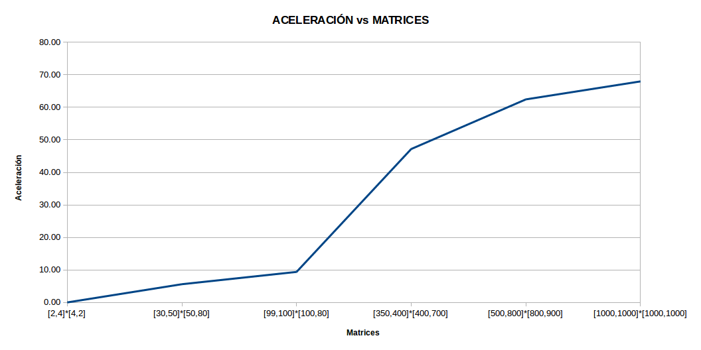

# Parcial I

**Estudiantes**
- Sebastian Duque Restrepo
- Manuel Fernando Sabogal Ocampo

## Objetivos

- Construir un programa que calcule la multiplicación (flotante) de matrices de cualquier tamaño A[M x N] y B[N x L] en CUDA usando tiles.

- Evaluar el desempeño del programa construido comparándolo con la versión secuencial del mismo en CPU.

- Se debe entregar un repositorio en Github por equipo de trabajo que contenga el código de ambas implementaciones, documentación sobre el código donde se explique detalladamente lo que se hace y en un documento en Markdown donde se especifiquen gráficas de tiempos y gráficas de aceleración, se debe tener un apartado de conclusiones del trabajo realizado.

## Introducción
Uno de los algoritmos que mejor explota las capacidades computacionales de la GPU, es la multiplicación matricial, debido a que las operaciones que se realizan son las mismas, solo que en distintos sectores de memoria, además de que son altamente independientes.

En esta comparativa se exponen dos algoritmos para la multiplicación de matrices, uno implementado de manera secuencial en CPU y otro paralelizado con una GPU optimizado mediante el uso de memoria compartida.

## Entorno de la prueba
Para la prueba se hizo uso de uno computador con las siguientes especificaciones:

| Nombre | Descripción |
|--------|-------------|
| Sistema Operativo | Ubuntu 16.04 LTS |
| CPU | Intel(R) Core(TM) i5-5200U CPU @ 2.20GHz |
| GPU | Nvidia GK208M [GeForce 920M] |
| CUDA | V7.5.17 |

Para las pruebas se harán 5 datasets de tamaños diferentes.

## Resultados

Los resultados obtenidos después de hacer la prueba en el entorno fueron los siguientes:

## Tablas Comparativas
Después de haber encontrado los resultados se hicieron 4 tablas las cuales muestran que tan rápido se comporta la implementación hecha en CPU vs la implementación hecha en GPU.

## Conclusiones

- Con base en los resultados obtenidos, se puede concluir que, en general, para la multiplicación de matrices se presenta un mejor desempeño en la implementación paralela en comparación de la implementación secuencial.
- Cuanta mayor cantidad de operaciones sea posible acelerar en GPU, y cuanta menor memoria sea necesaria transferir, mejor sera el desempeño de la GPU.
- Se puede notar que a medida que se van aumentando el tamaño de las matrices el tiempo que se toma el algoritmo secuencial crece exponencialmente mientras que en GPU siempre se mantiene de una forma estable
