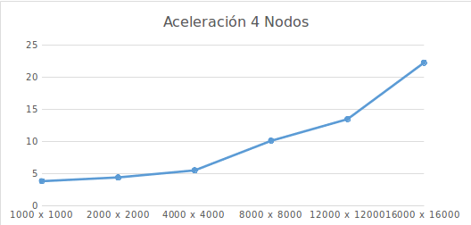

## Estudiantes
- Sebastian Duque Restrepo ([GitHub](https://github.com/sebas095/HPC/tree/master/Parcial%20II))
- Manuel Fernando Sabogal Ocampo ([GitLab](https://gitlab.com/edoren/HPC/tree/master/MPI/MultMatrixGPU))

## Introducción
Buscando la necesidad de crear sistemas de alto rendimiento distribuidos, los cuales puedan realizar cálculos de grandes tamaños en poco tiempo, a su vez hacer uso de las capacidades computacionales que tienen las GPUs. Se implementó un programa el cual realiza la multiplicación de matrices de gran tamaño en varios nodos de una red, para posteriormente hacer una comparación de desempeño con una implementación similar que hace uso de la CPU

## Glosario
- **CPU:** Unidad central de procesamiento del sistema, encargada de ejecutar tareas programadas por el sistema operativo.
- **GPU:** Es la unidad de procesamiento gráfico del sistema, la cual tiene un gran desempeño a la hora de hacer cálculos matemáticos y provee muchos núcleos de procesamiento.
- **Cluster:** Consiste en un conjunto de computadores unidos por un canal de datos y se comporta como si fuera una sola máquina.
- **Nodo**: Una máquina perteneciente a un cluster.

## Tecnologías usadas
Para el desarrollo de esta implementación se hizo uso de varias tecnologías en las cuales están:
- **MPI:** Una librería de paso de mensajes la cual permite hacer la distribución de datos en los nodos de una red.
- **CUDA:** Librería de computación paralela la cual hace uso de la capacidad computacional de las GPUs para realizar los procesos.
- **SLURM:** Un programador de trabajos el cual maneja las tareas que se están ejecutando en el cluster y a su vez permite el manejo de los recursos que cada tarea requiere para su ejecución.

## Entorno de ejecución
El entorno de ejecución es un cluster el cual tiene un nodo maestro y 6 nodos trabajadores a su disposición. Los nodos maestros poseen las siguientes características:
| Nombre            | Descripción                              |
|-------------------|------------------------------------------|
| Sistema Operativo | Ubuntu 16.04.1 LTS                       |
| CPU               | Intel(R) Core(TM) i7-6700K CPU @ 4.00GHz |
| GPU               | NVIDIA GM204 [GeForce GTX 980]           |
| Entorno de red    | Ethernet a 1Gbit/s 33MHz                 |

## Desarrollo
Haciendo uso de las tecnologías anteriormente nombradas, se asigna uno de los nodos asignados como el “maestro” del programa, el cual es el encargado de repartir cada uno de los trabajos a los nodos trabajadores.
El envio se hace por medio de OpenMPI, en donde para una multiplicación de AxB siendo A y B matrices especificamos que para cada nodo trabajador se enviará una cantidad igual de filas de A y se enviará la matriz B completa.
Cuando llega a cada trabajador, este reúne los datos y manda a ejecutar el trabajo o en CUDA o en la CPU. Espera por los resultados y los vuelve a enviar al master.
El master recibe los datos de las filas operadas en cada nodo para finalmente armar  matriz resultante.

La toma de tiempos se empieza antes del envió a cada uno de los nodos trabajadores, y termina luego de que cada uno de ellos retorne el resultado.

## Pruebas
Se hicieron pruebas con 4, 3, 2 y 1 nodo las cuales dieron los siguientes resultados.

### 1 Nodo
| Tamaño        | Tiempo CPU (segundos) | Tiempo GPU (segundos) | Aceleración   |
|---------------|-----------------------|-----------------------|---------------|
| 1000 x 1000   | 0.40371               | 0.370829              | 1.0886689013  |
| 2000 x 2000   | 4.00437               | 1.15418               | 3.4694501724  |
| 4000 x 4000   | 44.683                | 4.53535               | 9.8521613547  |
| 8000 x 8000   | 806.975               | 25.8571               | 31.2090296282 |
| 10000 x 10000 | 812.279               | 48.5268               | 16.7387711533 |
| 12000 x 12000 | 3072.62               | 82.0774               | 37.4356400178 |

### 2 Nodos
| Tamaño        | Tiempo CPU (segundos) | Tiempo GPU (segundos) | Aceleración   |
|---------------|-----------------------|-----------------------|---------------|
| 1000 x 1000   | 0.74246               | 0.593197              | 1.2516246711  |
| 2000 x 2000   | 3.46193               | 1.97922               | 1.7491385495  |
| 4000 x 4000   | 27.0269               | 7.84061               | 3.4470404726  |
| 8000 x 8000   | 432.823               | 38.9137               | 11.1226380426 |
| 12000 x 12000 | 1484.64               | 111.333               | 13.3351297459 |
| 13000 x 13000 | 1643.57               | 127.614               | 12.8792295516 |

### 3 Nodos
| Tamaño        | Tiempo CPU (segundos) | Tiempo GPU (segundos) | Aceleración   |
|---------------|-----------------------|-----------------------|---------------|
| 1000 x 1000   | 1.3486                | 0.479002              | 2.8154370963  |
| 2000 x 2000   | 5.32145               | 1.5996                | 3.3267379345  |
| 4000 x 4000   | 27.2015               | 6.18093               | 4.4008749492  |
| 8000 x 8000   | 322.055               | 28.3057               | 11.3777437053 |
| 12000 x 12000 | 1150.05               | 75.5007               | 15.2323091044 |
| 15000 x 15000 | 1824.69               | 132.709               | 13.7495573021 |

### 4 Nodos
| Tamaño        | Tiempo CPU (segundos) | Tiempo GPU (segundos) | Aceleración   |
|---------------|-----------------------|-----------------------|---------------|
| 1000 x 1000   | 1.9911                | 0.513018              | 3.881150369   |
| 2000 x 2000   | 7.44576               | 1.66549               | 4.4706122523  |
| 4000 x 4000   | 35.2784               | 6.34494               | 5.5600840985  |
| 8000 x 8000   | 281.306               | 27.7037               | 10.1540949404 |
| 12000 x 12000 | 948.302               | 70.1638               | 13.5155450531 |
| 16000 x 16000 | 3118.12               | 139.9                 | 22.2882058613 |

## Conclusiones
Luego de revisar el comportamiento de cada una de las ejecuciones en el cluster pudimos concluir lo siguiente:
- Uno de los inconvenientes surgidos en el desarrollo de las pruebas fue encontrar un tamaño adecuado de matriz para correr en la GPU, por tal razón usamos valores razonables los cuales no llenaban la GPU por completo y nos permiten un análisis mucho más rápido.
- Al aumentar las matrices su tamaño, una gran parte del tiempo se gasta en hacer el envío de estos datos a cada una de las tareas.
- El desempeño en el tiempo de envío cuando se evalúa en CPU puede ser mejorado si se usa una sola tarea por nodo y se hace uso de algún software que permita repartir los trabajos por cada uno de los núcleos de la CPU, tal como OpenMP.
- Entre mayor sea el número de nodos, el desempeño de la aplicación mejora, por tal razón se obtienen los resultados más rápido.
- Hacer uso de sistemas distribuidos para la resolución de este tipo de problemas, disminuye mucho la complejidad del mismo y permite hacer uso de muchos más recursos computacionales.
